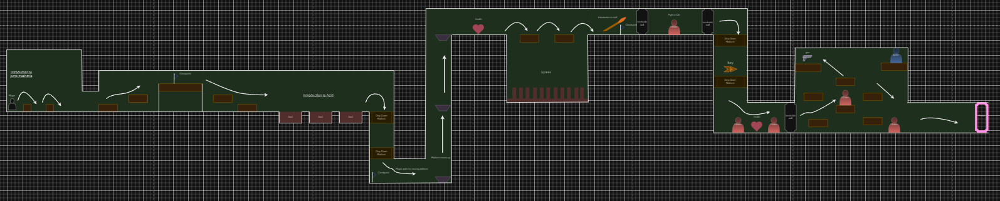

[](https://classroom.github.com/a/YyUO0xtt)
# COMP2150  - Level Design Document
### Name: Jon-Luca Nemcich
### Student number: 47722355

This document discusses and reflects on the design of your platformer level for the Level Design assessment. It should be 1500 words. Make sure you delete this and all other instructional text throughout the document before checking your word count prior to submission. Hint: You can check word count by copying this text into a Word or Google doc.

Your document must include images. To insert an image into your documentation, place it in the "DocImages" folder in this repo, then place the below text where you want the image to appear:

```

```

Example:


## 1. Player Experience (~700 words)
Outline and justify how your level design facilitates the core player experience goals outlined in the assignment spec. Each section should be supported by specific examples and screenshots of your game encounters that highlight design choices made to facilitate that particular experience. 

### 1.1. Discovery
What does the player learn? How does your encounter and broader level design facilitate learning in a way that follows good design practice?

Throughout the playtime in which the player traverses throughout the segmented level modules, the player learns the primary and basic mechanics required to progress through each encounter which slowly increases in difficulty, one after the other. Firstly, as the player loads into the level, they are met with a set of basic obstacles which prevent them from traversing the linear introduction to the level, seen in this excerpt of the level: 
!(DocImages/1.1Example1.PNG) 
As demonstrated by the image, the player immediately encounters two mossy rock formations blocking their path forward. This is where the player learns the Jump mechanic, a basic yet cornerstone mechanic which is key to the core gameplay experience provided by the platformer-esque level design split up into more difficult sections in a linear fashion. This line of design practice is followed up throughout the entirety of each encounter throughout the level, meaning that as the player is introduced to more interesting or challenging mechanics, they will have the prerequisite skills at the very least known in order to be able to take on and triumph the new encounter, as seen in this excerpt here, showcasing how the player is given a time to learn the subsequent mechanic, and then challenged to hone those skills in order to pass the encounter: 
!(DocImages/1.1Example2.PNG)

### 1.2. Drama
What is the intensity curve? How does your design facilitate increasing yet modulating intensity, with moments of tension and relief? 

The intensity curve in my level design is very up and down in terms of relief and tension, as I have connected encounters in a way which allows the player to briefly enjoy their victory, and then head to the next challenge which spikes tension, causing the player to focus on the perilous landscape infront of them. In this excerpt taken from the level, we can observe how the player is given a challenging encounter, introducing the spitter and vertical combat, followed by a brief moment of respite before jumping into the teleporter to reach the next segment, as seen here: 
!(DocImages/1.2Example1.PNG)
I felt as though using this kind of modulated tension and relief design philosophy throughout the entirety of the segmented levels added to the player experience and intensity curve, slowly upping the ante from each encounter, whilst providing a little bit of downtime for the player to rest and prepare for the next obstacle/encounter ahead. Additionally, I also prototyped each encounter in regards to how much of an intensity spike I wanted to give to the player per encounter and downtime. For example, in this encounter in segment 2 of the level, I was just initially going to put three chompers/clawers at the bottom and middle of the dropdown to surprise the player, seen in this excerpt here: 
!(DocImages/1.2Example2.PNG)
However, I decided to add some additional intensity by adding some more surprise obstacles for the player to experience, as I traded out the chomper in the middle for an acid pool, and added spikes to the sides of the second dropdown for some extra difficulty, forcing the player to coordinate their character through the tight window, as seen in this excerpt here:   
!(DocImages/1.2Example3.PNG)

### 1.3. Challenge
What are the main challenges? How have you designed and balanced these challenges to control the difficulty curve and keep the player in the flow channel?
The main challenges which are presented to the player are the coordination and timing of their jumps, along with dodging enemy attacks and using their weapons to dispatch the target, preferably before any damage is taken. These main challenges are presented through encounters which are designed to follow up on previously learned mechanics introducted periodically in the first segment, which allows the player to compound the players knowledge of each mechanic in order to complete the encounter, and so on. Each encounter is controlled to where it gives the player a boost of condifence when they complete a difficult encounter, and maintaining that confidence when traversing an easier one, depending on their skill level developed from previous mechanic introductions and encounters. When prototyping the difficulty curve, I decided to make it harmonise with the tension curve for majority of the level, as I felt difficulty and tension corrosponded well in this instance. For example, in this excerpt I tried to keep the difficulty curve going after the player passes through the vertical combat encounter at the end of segment 2 by putting spikes in each wall in a staggered position on the way down to the next encounter, seen here: 
!(DocImages/1.3Example1.PNG)
However, I decided against it, instead removing them and providing the player with some brief downtime between difficulty curves, as seen here 
!(DocImages/1.3Example2.PNG)

### 1.4. Exploration
How does your level design facilitate autonomy and invite the player to explore? How do your aesthetic and layout choices create distinct and memorable spaces and/or places?
My level design facilitates autonomy for the player to explore in a linear fashion, as I decided to go with a more direct approach to showing the player what is available for exploration in regards to encounters and how to handle them. When storyboarding, I came across instances that accidentally presented an alternative method to complete the encounter presented to the player. However, instead of completely sticking to the linear design philosophy, I decided to incorporate this little bit of non linear design when it comes to how players complete each level, which facilitates the players autonomy and invites the player to explore wasy to complete an ecnounter in their own way, rather than they way the level tells you to. For example, I incorporated this thinking into one of my vertical combat encounters where the player uses a moving platform to traverse up and fight spitters while travelling. However, I also implemented the wall to wall method of using the spitter platforms to jump to and fro, completely skipping the need for a platform if they player wanted to ignore it. This is seen here: 
!(DocImages/1.4Example1.PNG)   

## 2. Core Gameplay (~400 words)
A section on Core Gameplay, where storyboards are used to outline how you introduce the player to each of the required gameplay elements in the first section of the game. Storyboards should follow the format provided in lectures.

Storyboards can be combined when multiple mechanics are introduced within a single encounter. Each section should include a sentence or two to briefly justify why you chose to introduce the mechanic/s to the player in that sequence.

You should restructure the headings below to match the order they appear in your level.

### 2.1. Checkpoints
!(DocImages/2.1Example1.PNG)
I chose to introduce the checkpoint as one of the first core mechanics which is given to the player for two key reasons. Firstly, I believed it to be critical that they player knows what a checkpoint looks like and its function at the beginning fo the level rather than in more difficult sections. Secondly, once the player is introduced to the Checkpoint mechanic early on, it gives them the ability to identify points of respite within the level, modulating relief and tension with the mechanic itself.
### 2.2. Acid
!(DocImages/2.2Example1.PNG)
I chose to implement the acid mechanic after the checkpoint so that it would work in tandem with it, in regards to discovering its functionality if the player ever fell victim to a miscalculated jump and had to respawn. Acid is also one of the more avoidable early game threats which I would introduce to the player as they progressed through each segment, meaning that it was a simple yet effective way to force the player to take in all aspects of the environment when making a jump instead of bruteforcing it and jumping as high or far as they could.
### 2.3. Passthrough Platforms
!(DocImages/2.3Example1.PNG)
Passthrough platforms was introduced after the acid to provide the player with a less tense mechanic introduction, as in the early stages of the level there are no threats waiting underneath the dropdown until after the threat mechanic has been introduced. By allowing the player to figure out how to use drop-down/passthrough platforms early on, I believe it would streamline the players movement while also providing a surprise later down the line where threat mechanics were introduced after the passthrough platforms and incorporated with them.
### 2.4. Moving Platforms
!(DocImages/2.4Example1.PNG)
Moving Platforms were almost immediately introduced after the passthrough platforms as I wanted to condense the "platform mechanic" learning experience so that the player would have a greater knowledge set for upcoming challenges or surprises which relied on the ability for the player to know how to use the platform correctly. I used the line of thinking previously mentioned with the passthrough platforms, introducing them without a threat to contend with in order to solidify player understanding.
### 2.5. Health Pickups
!(DocImages/2.5Example1.PNG)
Health Pickups are a key core gameplay mechanic which is offered to the player right before a challenging jumping sequence. There were some opportunities where the player could have possibly lost some health points before the jumping encounter, and I decided to moderate tension by offering the player a top up on lives or an extra life if they did not take damage, as a 'mulligan' of sorts. 
### 2.6. Spikes
!(DocImages/2.6Example1.PNG)
I decided to introduce spikes shortly after the health pickup mechanic through the use of a classic spike pit jump encounter. The player has to use their now compounded knowledge of jumping mechanics to successfully evade a damaging spike pit. If they fall in, they take damage and can clamber back up onto a ledge I have created so they can attempt the puzzle again. 
### 2.7. Weapon Pickup (Staff)
!(DocImages/2.7Example1.PNG)
The Staff and Chomper Mechanics are introduced almost side by side, as the player has to utilize the staff in order to break down a wall and face the chomper.
### 2.8. Chompers
!(DocImages/2.8Example1.PNG)
Refer to previous segment.
### 2.9. Keys
!(DocImages/2.9Example1.PNG)
Reletively straight forward introduction, not much to describe other than it gives the player a goal asto what to look for.
### 2.10. Weapon Pickup (Gun) & 2.11. Spitters
!(DocImages/2.10+11Example1.PNG)
I decided to implement the spitter and gun mechanics in tandem as it gave the player a ranged alternative to fight the spitter whilst also learning how to dodge its attacks.


## 3. Spatiotemporal Design
A section on Spatiotemporal Design, which includes your molecule diagram and annotated level maps (one for each main section of your level). These diagrams may be made digitally or by hand, but must not be created from screenshots of your game. The annotated level maps should show the structure you intend to build, included game elements, and the path the player is expected to take through the level. Examples of these diagrams are included in the level design lectures.

No additional words are necessary for this section (any words should only be within your images/diagrams).
 
### 3.1. Molecule Diagram
!(DocImages/MoleculeDiagram.PNG)
### 3.2. Level Map – Section 1
 
### 3.3.	Level Map – Section 2
!(DocImages/Segment2.PNG)
### 3.4.	Level Map – Section 3
!(DocImages/Segment3.PNG)
## 4. Iterative Design (~400 words)
Reflect on how iterative design helped to improve your level. Additional prototypes and design artefacts should be included to demonstrate that you followed an iterative design process (e.g. pictures of paper prototypes, early grey-boxed maps, additional storyboards of later gameplay sequences, etc.). You can also use this section to justify design changes made in Unity after you drew your level design maps shown in section 3. 

You should conclude by highlighting a specific example of an encounter, or another aspect of your level design, that could be improved through further iterative design.

Iterative design was an excellent helper do my level design as I had originally envisioned a sort of darker, more cave-like level format for the original level design, and after making some quickly designed prototypes and aesthetic types, I came to a strange yet intriguing mix of a mossy, floating rock cave situated high up in the sky, adding to that magical feeling by creating and placing portals to arrive at each different segment, as seen in these 2 examples: 
!(DocImages/4Example1.PNG)
!(DocImages/4Example2.PNG)
 Additionally, I was playing around with the portal mechanic using storyboards to figure out how to implement them into my gameworld, which is where I eventually got the idea of using portals as a travel method between segments, as seen here: 
 !(DocImages/4Example3.PNG)
Finally, while experimenting with the design of the level segments, I had an outside source play the game in the form of my Mother to get a grasp on a low to moderately skilled players perspective. She cleared the whole level after around 10 minutes (after multiple attempts). She did note that the jumps were a bit too difficult in the later sections, which could be improved further using the iterative design method in order to accommodate for lower skilled players while maintaining a healthy skill gap for difficulty and tension curves.

## Generative AI Use Acknowledgement

Use the below table to indicate any Generative AI or writing assistance tools used in creating your document. Please be honest and thorough in your reporting, as this will allow us to give you the marks you have earnt. Place any drafts or other evidence inside this repository. This form and related evidence do not count to your word count.
An example has been included. Please replace this with any actual tools, and add more as necessary.


### Tool Used: I did not use any Generative AI in my work.
**Nature of Use** N/A

**Evidence Attached?** N/A

**Additional Notes:** N/A


